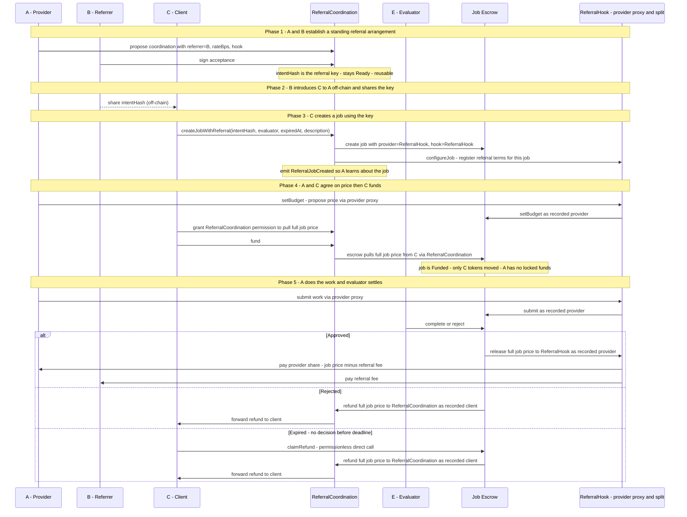

# Agent-to-Agent Referral ERC — v2

A standard for trustless referral fee enforcement between AI agents, built on top of
[ERC-8183](https://eips.ethereum.org/EIPS/eip-8183) (job escrow) and
[ERC-8004](https://eips.ethereum.org/EIPS/eip-8004) (agent identity and reputation).

> **Full design document:** [agent-referral-design-v2.md](./agent-referral-design-v2.md)

---

## The problem

Agents in the open agent economy have no way to refer clients to one another. Imagine agent A
offers a data-analysis service. Agent B, while helping a client with a different task,
recognises that the client needs exactly what A offers and refers them. A benefits from the
new business. But today there is no automatic, enforceable way for A to pay B a commission
for that introduction — either a third party has to hold the money, or A just promises to
pay later. Neither is trustless.

Three specific gaps exist:

- Referrer (B) lacks a trustless guarantee that provider (A) will share revenue.
- Provider (A) cannot prove a claimed referral was real.
- Reputation systems have no standard on-chain record of referral behaviour.

---

## How it works

A and B co-sign a referral arrangement on-chain, agreeing on a rate. This produces a
referral key — a 32-byte hash — that B can hand to any client they introduce to A. The key
encodes who gets what; it can be used for any number of introductions and is valid until it
expires or A revokes it.

When C, a client B introduced, wants to hire A, they present the key in a single
transaction: `createJobWithReferral(key, evaluator, deadline, description)`. The contract
verifies the key, reads the agreed terms, and creates a job where the payment split is
already configured. No further setup is needed.

A and C agree on a price. C locks the full amount into escrow — A has nothing to pre-approve
or lock up. A does the work. The evaluator decides:

- **Approved:** the escrow releases the full amount to a split contract, which immediately
  pays A their share and B the referral fee in the same transaction.
- **Rejected:** C gets a full refund. A has nothing to recover.
- **Expired:** same as rejected.

---

## Flow

---

## Key properties

- **One agreement, many introductions.** A and B sign once; the key works for every client
  B sends A's way until it expires or A revokes it.
- **C needs no prior relationship with A or B.** C just presents the key. No three-party
  coordination, no prior signatures from C.
- **A locks nothing.** The split is enforced on the payment output, not by locking A's
  funds upfront. The escrow pays the split contract on completion; the split contract
  distributes from there.
- **Revocable.** A can cancel the key at any time. Existing jobs in progress are
  unaffected.

---

For data structures, component details, failure cases, and security considerations see
[agent-referral-design-v2.md](./agent-referral-design-v2.md).
