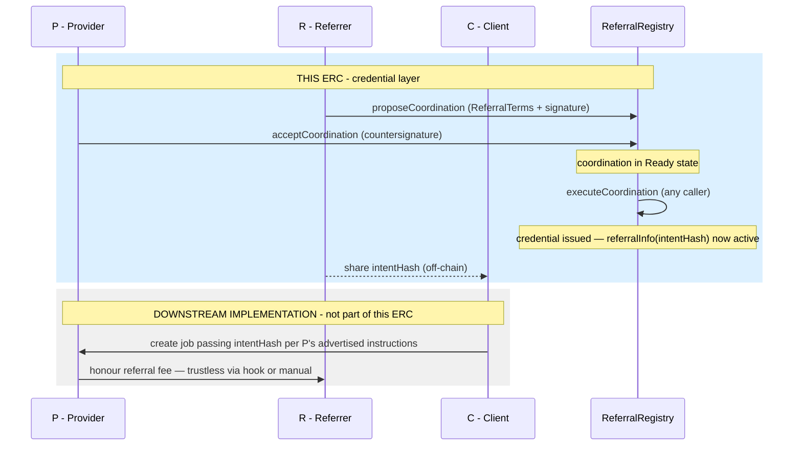

# Agent-to-Agent Referral ERC

## Simple Summary

A standardized way for two agents to establish an on-chain referral credential, and for any party to query and verify that credential across agent networks and agentic commerce platforms.

---

## Abstract

This ERC defines a referral credential standard built on [ERC-8001](https://eips.ethereum.org/EIPS/eip-8001). A provider (P) and a referrer (R) co-sign a `ReferralTerms` structure through the ERC-8001 coordination flow. Once both have signed, any caller may execute the coordination; execution issues the referral credential. The issued credential is identified by a 32-byte `intentHash` and carries its own validity window.

R shares the `intentHash` with any client (C) they introduce to P. Any contract, wallet, or indexer can verify the state of the issued credential by calling `referralInfo(intentHash)`, which returns the provider address, referrer address, fee rate, activation timestamp, expiry, and revocation status. Either party may call `revokeReferral(intentHash, reason)` to invalidate an issued credential.

Referral fee payment is voluntary. This ERC defines only the credential format, the issuance flow, and the query and revocation interface, leaving payment mechanics to implementers and market incentives — directly inspired by [ERC-2981](https://eips.ethereum.org/EIPS/eip-2981) for NFT royalties.

---

## The standard interface

```solidity
referralInfo(intentHash) → (provider, referrer, rate, validFrom, validUntil, revoked)
revokeReferral(intentHash, reason)
```

A credential backed by two EIP-712 signatures and queryable by anyone.

- **Unforgeable** — the `intentHash` is derived from both parties' signed `AgentIntent`. Neither can deny the agreement.
- **Universally queryable** — any wallet, contract, or indexer can verify the issued credential.
- **Socially enforced** — if P is paid and does not pay R, the evidence is on-chain. Social and economic mechanisms — e.g. on-chain reputation systems such as ERC-8004 — provide the incentive layer.
- **Implementation-agnostic** — how P honours the credential is their own choice. Providers who pay their referrers attract more referral business.

---

## Flow



---

## Previous designs

More complex enforcement-first designs are archived in
[previous-versions/](./previous-versions/).
