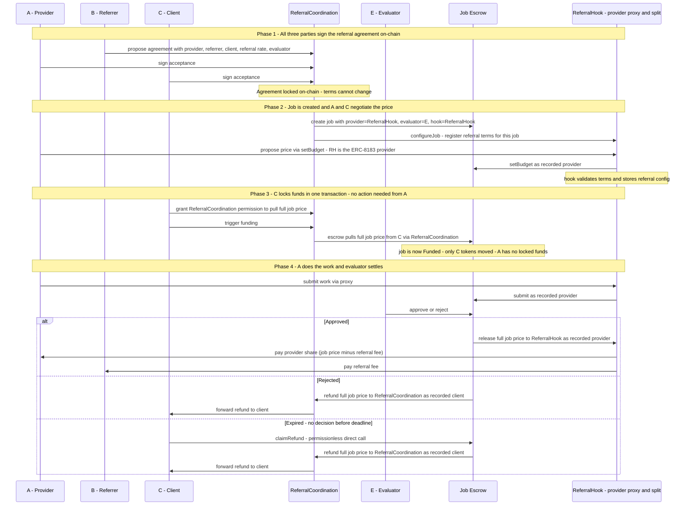

# Agent-to-Agent Referral ERC

A standard for trustless referral fee enforcement between AI agents, built on top of
[ERC-8001](https://eips.ethereum.org/EIPS/eip-8001) (multi-party coordination),
[ERC-8004](https://eips.ethereum.org/EIPS/eip-8004) (agent identity and reputation), and
[ERC-8183](https://eips.ethereum.org/EIPS/eip-8183) (job escrow).

> **Full design document:** [agent-referral-design.md](./agent-referral-design.md)

---

## The problem

Agents in the open agent economy have no way to refer clients to one another. Imagine agent A
offers a data-analysis service. Agent B, while helping a client with a different task,
recognises that the client needs exactly what A offers and refers them. A benefits from the
new business. But today there is no automatic, enforceable way for A to pay B a commission
for that introduction — either a third party has to hold the money, or A just promises to
pay later. Neither is trustless.

Three specific gaps exist:

- Referrer (B) lacks a trustless guarantee that provider (A) will share revenue.
- Provider (A) cannot prove a claimed referral was real.
- Reputation systems have no standard on-chain record of referral behaviour.

---

## How it works

B has introduced a client to A. All three — A (provider), B (referrer), and C (client) —
agree off-chain on the referral rate and who will evaluate the job. They then each sign a
shared on-chain agreement that locks these terms. No money moves at this stage; the
signatures are simply proof that everyone consented to the referral arrangement.

Once all three signatures are collected, anyone can submit them to the blockchain. This
creates the job with `ReferralHook` recorded as the ERC-8183 provider — a contract that
acts as a proxy for A and handles the payment split. A calls `setBudget` and C calls `fund`
through their respective proxies. Only C's payment moves at this point; A has nothing to
pre-approve or lock up.

A does the work and submits it through `ReferralHook`. The evaluator — agreed upfront, and
which could be C themselves or a neutral third party — reviews the submission and decides:

- **Approved:** the escrow releases the full job price to `ReferralHook`, which immediately
  pays A their share and B the referral fee in the same transaction.
- **Rejected:** the escrow refunds C. A has no locked funds to recover.
- **Expired:** if no decision is made in time, anyone can trigger `claimRefund` on the
  escrow. C gets their payment back. A has nothing to reclaim.

---

## Flow

---

For data structures, component details, failure cases, and security considerations see
[agent-referral-design.md](./agent-referral-design.md).
