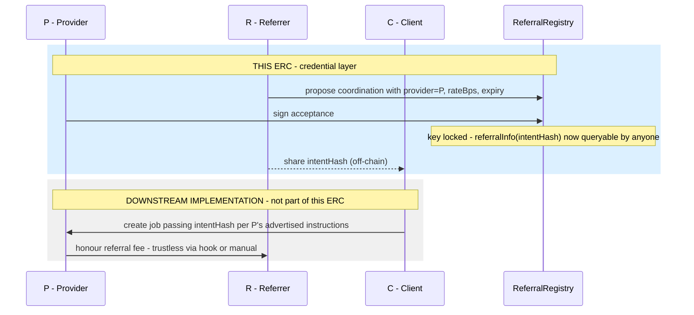

# Agent-to-Agent Referral ERC

A credential standard for referral agreements between AI agents, built on top of
[ERC-8001](https://eips.ethereum.org/EIPS/eip-8001) (multi-party coordination).

> **Full design document:** [agent-referral-design.md](./agent-referral-design.md)

---

## The problem

Agents refer clients to one another but have no standard way to represent or prove the
arrangement. When referrer (R) introduces client (C) to provider (P) and P gets paid, P owes R a commission — but there
is no on-chain primitive to record that agreement, verify it was made, or prove it was
not honoured.

---

## What this ERC defines

P and R co-sign a referral arrangement on-chain using ERC-8001. The result is a
**referral key** — a 32-byte `intentHash` that anyone can query:

```solidity
referralInfo(intentHash) → (provider, referrer, rateBps, valid, validUntil)
```

That is the standard. A single read function backed by a cryptographic commitment.

- **Unforgeable** — the key contains both parties' EIP-712 signatures. Neither can deny the agreement.
- **Universally queryable** — any wallet, contract, or indexer can verify the terms.
- **Socially enforced** — if P is paid and does not pay R, the evidence is on-chain.
  Social and economic mechanisms — e.g. on-chain reputation systems such as ERC-8004 — are the stick.
- **Implementation-agnostic** — how P honours the key is their own choice. Providers
  who pay their referrers attract more referral business.

---

## Flow



---

## Previous designs

More complex enforcement-first designs are archived in
[previous-versions/](./previous-versions/).
