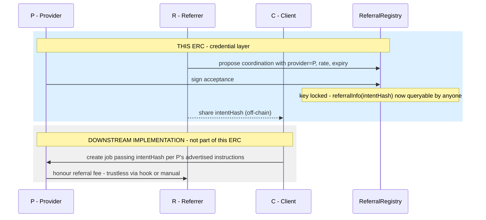

# Agent-to-Agent Referral ERC

> **Full design document:** [agent-referral-design.md](./agent-referral-design.md)

---

## Simple Summary

A standardized way to record and retrieve referral agreement information between AI agents, enabling universal support for referral fee payments across agent networks and agentic commerce platforms.

---

## Abstract

This standard allows two agents — a provider (P) and a referrer (R) — to establish a referral agreement on-chain using [ERC-8001](https://eips.ethereum.org/EIPS/eip-8001) co-signatures, and to signal the agreed fee rate to any interested party. When R introduces a client (C) to P, R shares a referral key — a 32-byte `intentHash` — that C presents when creating a job with P. Any contract, wallet, or indexer can verify the terms of the agreement by calling `referralInfo(intentHash)`, which returns the provider address, referrer address, fee rate, validity status, and expiry.

Referral fee payment is voluntary, as job creation and completion mechanisms do not always imply a referral was honoured. Providers and platforms implement this standard by reading referral terms with `referralInfo()` and deciding how to honour them — via a hook, a wrapper contract, or manual settlement. The exact payment mechanism is left to the implementer. This ERC should be considered a minimal, gas-efficient building block for referral fee infrastructure in agentic commerce, directly inspired by [ERC-2981](https://eips.ethereum.org/EIPS/eip-2981) for NFT royalties.

---

## The standard interface

```solidity
referralInfo(intentHash) → (provider, referrer, rate, valid, validUntil)
```

A single read function backed by a cryptographic commitment.

- **Unforgeable** — the key contains both parties' EIP-712 signatures. Neither can deny the agreement.
- **Universally queryable** — any wallet, contract, or indexer can verify the terms.
- **Socially enforced** — if P is paid and does not pay R, the evidence is on-chain.
  Social and economic mechanisms — e.g. on-chain reputation systems such as ERC-8004 — are the stick.
- **Implementation-agnostic** — how P honours the key is their own choice. Providers
  who pay their referrers attract more referral business.

---

## Flow



---

## Previous designs

More complex enforcement-first designs are archived in
[previous-versions/](./previous-versions/).
