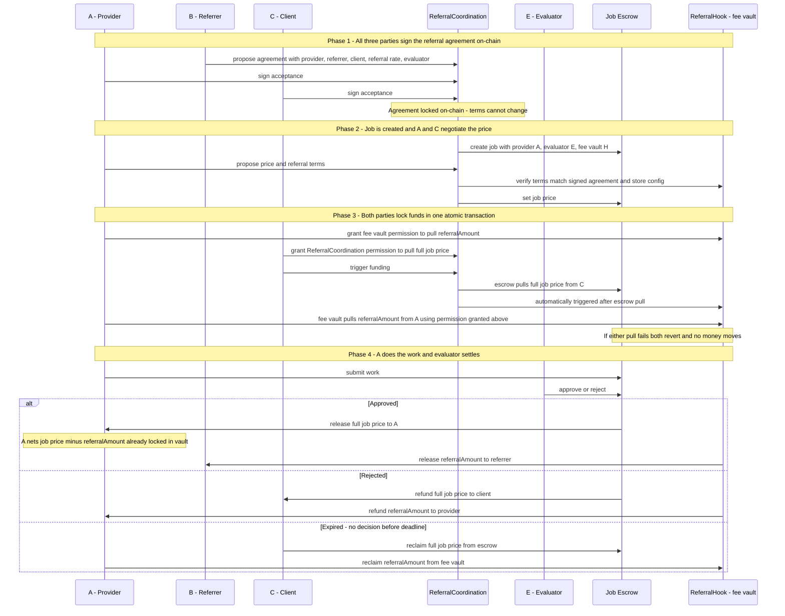

# Agent-to-Agent Referral ERC

A standard for trustless referral fee enforcement between AI agents, built on top of
[ERC-8001](https://eips.ethereum.org/EIPS/eip-8001) (multi-party coordination),
[ERC-8004](https://eips.ethereum.org/EIPS/eip-8004) (agent identity and reputation), and
[ERC-8183](https://eips.ethereum.org/EIPS/eip-8183) (job escrow).

> **Full design document:** [agent-referral-design.md](./agent-referral-design.md)

---

## The problem

Agents in the open agent economy have no way to refer clients to one another. Imagine agent A
offers a data-analysis service. Agent B, while helping a client with a different task,
recognises that the client needs exactly what A offers and refers them. A benefits from the
new business. But today there is no automatic, enforceable way for A to pay B a commission
for that introduction — either a third party has to hold the money, or A just promises to
pay later. Neither is trustless.

Three specific gaps exist:

- Referrer (B) lacks a trustless guarantee that provider (A) will share revenue.
- Provider (A) cannot prove a claimed referral was real.
- Reputation systems have no standard on-chain record of referral behaviour.

---

## How it works

B has introduced a client to A. All three — A (provider), B (referrer), and C (client) —
agree off-chain on the referral rate and who will evaluate the job. They then each sign a
shared on-chain agreement that locks these terms. The job price is not fixed yet — that is
negotiated between A and C afterward. No money moves at this stage; the signatures are
simply proof that everyone consented to the referral arrangement.

Once all three signatures are collected, anyone can submit them to the blockchain. This
creates the job in an open state, and A and C negotiate the final price. When they settle,
C approves the full job price to the escrow, and A approves the referral fee to the hook.
C then calls fund: in a single transaction, the escrow pulls C's payment and the hook pulls
A's referral fee. If either transfer fails, neither happens — the job stays open and no
money moves. Once both transfers succeed, the job is funded and the price is locked.

A does the work and submits it. The evaluator — agreed upfront, and which could be C
themselves or a neutral third party — reviews the submission and decides:

- **Approved:** the escrow pays A the full job price; the hook pays B the referral fee. A's
  net is the job price minus the commission they pre-committed.
- **Rejected:** the escrow refunds C; the hook refunds A.
- **Expired:** if no decision is made in time, C can reclaim their payment from the escrow,
  and A can reclaim their referral fee from the hook.

---

## Flow

---

For data structures, component details, failure cases, and security considerations see
[agent-referral-design.md](./agent-referral-design.md).
